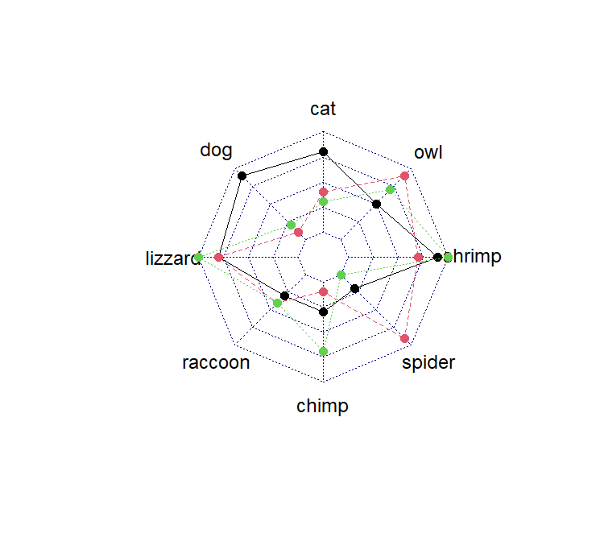
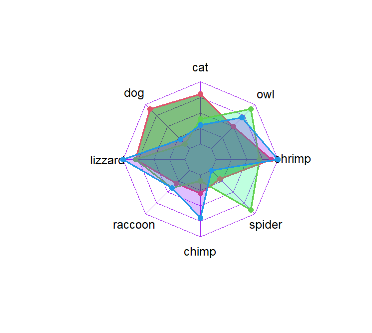

## 1. Get packages

```r
install.packages("fmsb")

```

## 2. data 

```r
df <- data.frame(rbind(rep(10, 8), # This row for upper limit
                       rep(0, 8),  # This row for bottom limit
                        matrix(sample(0:10, 24,
                                      replace = TRUE),
                               nrow = 3)))

colnames(df)<- c("cat","dog","lizzard","raccoon","chimp","spider","shrimp","owl") # index names
```

## 3. Plot 
```r
radarchart(df)
```



```r
areas <- c(rgb(0, 0.5, 0, 0.5),
           rgb(0, 1, 0.5, 0.25),
           rgb(0.5, 0, 1, 0.25))

radarchart(df,
           cglty = 1,       # Grid line type
           cglcol = "purple", # Grid line color
           pcol = 2:4,      # Color for each line
           plwd = 2,        # Width for each line
           plty = 1,        # Line type for each line
           pfcol = areas) 

```

